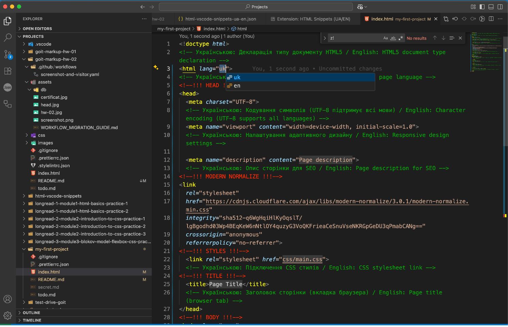

### 🌐 Виберіть для Вас комфортну мову:

[🇺🇦 Українська](README.md) | [🇬🇧 English](README.en.md) |
[🇩🇪 Deutsch](README.de.md)

# HTML5 & BEM Snippets for VS Code

<!-- AUTOGEN:STATS -->
[](https://developer.mozilla.org/en-US/docs/Web/HTML) [](https://code.visualstudio.com/) [](https://github.com/) [](https://www.figma.com/) 

[](https://github.com/VuToV-Mykola/html-vscode-snippets/graphs/traffic)
[](https://github.com/VuToV-Mykola/html-vscode-snippets/actions/workflows/screenshot-and-visitor.yaml)
[](https://github.com/VuToV-Mykola/html-vscode-snippets)
[](https://github.com/VuToV-Mykola/html-vscode-snippets)
[](https://github.com/VuToV-Mykola/html-vscode-snippets/blob/main/LICENSE)
[](https://github.com/VuToV-Mykola/html-vscode-snippets/releases)

## 📸 Скріншот проекту

<!-- END:AUTOGEN -->

Колекція зручних снипетів для швидкої HTML5-верстки з використанням
BEM-методології. Повністю підтримує семантичну верстку, доступність та сучасні
підходи до розробки. Розроблено завдячуючи знанням отриманим на курсах GoIT з
використанням штучного інтелекту.

## 🎥 Відео-приклад

🇺🇦
[](https://www.youtube.com/watch?v=ZEnn5RbKXUw)

## ✨ Особливості

- 🔤 111 HTML5 тегів з префіксом `x` (наприклад, `xarticle`, `xform`)
- 🧩 20+ готових компонентів з префіксом `z` (наприклад, `zcard`, `zmodal`)
- 📄 Повний шаблон сторінки (`z!`) з семантикою та мета-даними
- 🔧 BEM-нотація для класів
- 🦾 ARIA-атрибути та доступність
- 📦 Lazy loading для зображень
- 🧠 Інтерактивні плейсхолдери

## 🚀 Встановлення

1. Завантаж `.vsix` файл з
   [релізів](https://github.com/VuToV-Mykola/html-vscode-snippets/releases/latest)
2. У VS Code:
   - Відкрий палітру команд (Ctrl+Shift+P)
   - Введи `Extensions: Install from VSIX...`
   - Обери файл `html-bem-snippets.vsix`

## 🛠 Приклад використання

Після встановлення просто введи:

```
xsection
zcard
z!
```

і обери шаблон зі списку підказок.

## 📚 Документація

- [HTML5 Специфікація](https://html.spec.whatwg.org/)
- [Методологія BEM](https://en.bem.info/methodology/)
- [WAI-ARIA Практики доступності](https://www.w3.org/WAI/ARIA/apg/)
- [MDN Web Docs](https://developer.mozilla.org/uk/)

## 📜 Ліцензія

MIT © [Mykola VuToV](https://github.com/VuToV-Mykola)
